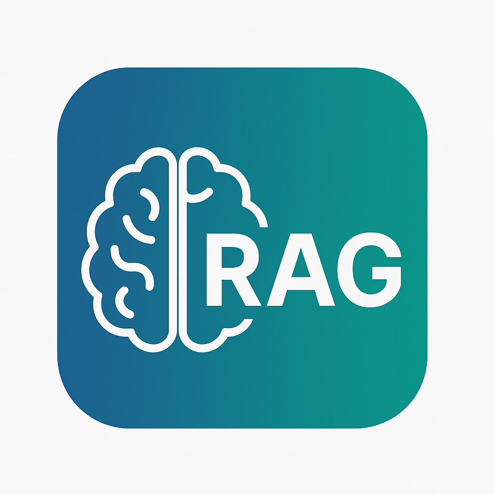

# RAG-Types

  <h3>A comprehensive collection of Retrieval-Augmented Generation implementations</h3>
  
Built with LangChain, ChromaDB, and OpenAI

    

## 📚 Introduction

Retrieval-Augmented Generation (RAG) is an AI framework that enhances Large Language Models (LLMs) by retrieving factual information from external knowledge sources before generating responses.

<h2>🤔 Why RAG?</h2>

  
Large Language Models (LLMs) face several critical limitations that RAG helps to overcome:

  
  <ul>
    <li><strong>Knowledge Cutoffs</strong>: LLMs have knowledge cutoffs and cannot access information beyond their training data</li>
    <li><strong>Hallucinations</strong>: LLMs can generate plausible-sounding but factually incorrect information</li>
    <li><strong>Verification Challenges</strong>: Sources of generated information are difficult to verify or cite</li>
    <li><strong>Data Privacy</strong>: Organizations need to use their proprietary data without sharing it with model providers</li>
    <li><strong>Cost Efficiency</strong>: Fine-tuning large models on domain-specific data is expensive and time-consuming</li>
  </ul>
  
  
RAG solves these problems by retrieving relevant information from trusted knowledge sources before generating responses, ensuring accuracy and verifiability.

<h2>🧩 RAG Implementation Types</h2>

<h3>✅ Classic RAG</h3>

  <h4>How It Works</h4>
  <ol>
    <li>User submits a query</li>
    <li>System converts query to vector embedding</li>
    <li>System retrieves similar documents from vector database</li>
    <li>Retrieved documents are combined with the query as context</li>
    <li>LLM generates response based on the query and retrieved context</li>
  </ol>

  <h4>Use Cases</h4>
  <ul>
    <li>Question answering systems</li>
    <li>Knowledge base search</li>
    <li>Basic chatbots with factual grounding</li>
  </ul>

  <h4>Advantages</h4>
  <ul>
    <li>Simple implementation</li>
    <li>Reduced hallucinations compared to standalone LLMs</li>
    <li>Can work with various document types and knowledge sources</li>
  </ul>

<h3>✅ RAG with Prompt Engineering</h3>

  <h4>How It Works</h4>
  <ol>
    <li>User submits a query</li>
    <li>System retrieves relevant documents</li>
    <li>System applies carefully crafted prompt templates that:
      <ul>
        <li>Format the retrieved information optimally</li>
        <li>Include specific instructions for the LLM</li>
        <li>May inject additional context or domain knowledge</li>
      </ul>
    </li>
    <li>LLM generates a response following the engineered prompt structure</li>
  </ol>

  <h4>Use Cases</h4>
  <ul>
    <li>Domain-specific applications requiring particular response formats</li>
    <li>Applications needing consistent tone or style</li>
    <li>Systems where specific reasoning steps are important</li>
  </ul>

  <h4>Advantages</h4>
  <ul>
    <li>Improved response quality through better context structuring</li>
    <li>Greater control over output format and style</li>
    <li>Can guide the LLM to follow specific reasoning paths</li>
  </ul>

<h3>✅ RAG-Fusion</h3>

  <h4>How It Works</h4>
  <ol>
    <li>User submits a query</li>
    <li>System generates multiple query variations from the original</li>
    <li>Each query variation is used to retrieve documents</li>
    <li>Results from all queries are combined using ranking fusion algorithms (like Reciprocal Rank Fusion)</li>
    <li>The most relevant documents across all query results are selected</li>
    <li>LLM generates a response using the fused results as context</li>
  </ol>

  <h4>Use Cases</h4>
  <ul>
    <li>Complex question answering where different query formulations retrieve different relevant information</li>
    <li>Research applications requiring comprehensive information gathering</li>
    <li>Applications where recall (finding all relevant information) is critical</li>
  </ul>

  <h4>Advantages</h4>
  <ul>
    <li>Improves retrieval robustness by considering multiple query formulations</li>
    <li>Mitigates vocabulary mismatch problems</li>
    <li>Higher recall of relevant information</li>
    <li>Reduces sensitivity to exact query wording</li>
  </ul>

<h3>✅ RAG + Reranking</h3>

  <h4>How It Works</h4>
  <ol>
    <li>User submits a query</li>
    <li>System performs initial retrieval of a larger set of potentially relevant documents</li>
    <li>A second-stage reranker model evaluates query-document relevance more precisely</li>
    <li>Documents are reordered based on the reranker's scores</li>
    <li>Top-ranked documents after reranking are used as context</li>
    <li>LLM generates a response based on the reranked context</li>
  </ol>

  <h4>Use Cases</h4>
  <ul>
    <li>Applications requiring high precision in document retrieval</li>
    <li>Systems with large knowledge bases where initial retrieval may have noise</li>
    <li>Legal or medical applications where accuracy is critical</li>
  </ul>

  <h4>Advantages</h4>
  <ul>
    <li>Improved precision in document selection</li>
    <li>Can use computationally expensive but accurate models for the reranking stage</li>
    <li>Combines efficiency of vector search with accuracy of cross-encoders</li>
    <li>More relevant context leads to better LLM responses</li>
  </ul>

<h3>✅ Conversational RAG</h3>

  <h4>How It Works</h4>
  <ol>
    <li>User engages in multi-turn conversation</li>
    <li>System maintains conversation history</li>
    <li>For each new query, system considers:
      <ul>
        <li>The current query</li>
        <li>Previous exchanges in the conversation</li>
        <li>Contextual information from earlier turns</li>
      </ul>
    </li>
    <li>System retrieves relevant documents based on the contextualized query</li>
    <li>LLM generates a response that maintains conversation coherence while incorporating retrieved information</li>
  </ol>

  <h4>Use Cases</h4>
  <ul>
    <li>Customer support chatbots</li>
    <li>Virtual assistants with memory</li>
    <li>Interactive knowledge exploration systems</li>
    <li>Educational dialogue systems</li>
  </ul>

  <h4>Advantages</h4>
  <ul>
    <li>Maintains context across conversation turns</li>
    <li>Resolves references and ambiguities using conversation history</li>
    <li>Provides coherent, flowing conversation experience</li>
    <li>Eliminates need for users to repeat information</li>
  </ul>

<h3>✅ Agentic RAG</h3>

  <h4>How It Works</h4>
  <ol>
    <li>User submits a complex query or task</li>
    <li>System decomposes the task and determines what information is needed</li>
    <li>Agent selects appropriate tools based on the task (e.g., retrieval, calculation, API calls)</li>
    <li>Agent executes a series of steps, potentially including:
      <ul>
        <li>Multiple targeted retrievals</li>
        <li>Reasoning about intermediate results</li>
        <li>Using external tools or APIs</li>
      </ul>
    </li>
    <li>Agent integrates information from all sources</li>
    <li>LLM generates comprehensive response based on the collected information</li>
  </ol>

  <h4>Use Cases</h4>
  <ul>
    <li>Complex problem-solving requiring multiple knowledge sources</li>
    <li>Research assistants that can search, analyze, and synthesize information</li>
    <li>Systems that need to combine information retrieval with computation or external tools</li>
    <li>Decision support systems</li>
  </ul>

  <h4>Advantages</h4>
  <ul>
    <li>Can solve multi-step problems requiring diverse information</li>
    <li>Adapts retrieval strategy based on task requirements</li>
    <li>Combines knowledge retrieval with other capabilities (calculation, API calls)</li>
    <li>More autonomous and flexible than simpler RAG approaches</li>
  </ul>

<h3>✅ Hybrid RAG</h3>

  <h4>How It Works</h4>
  <ol>
    <li>User submits a query</li>
    <li>System processes the query through two parallel retrieval paths:
      <ul>
        <li>Sparse retrieval: Using keyword-based methods (BM25, TF-IDF)</li>
        <li>Dense retrieval: Using vector embeddings and semantic similarity</li>
      </ul>
    </li>
    <li>Results from both methods are combined using a fusion algorithm</li>
    <li>The combined set of documents is used as context</li>
    <li>LLM generates a response based on the hybrid-retrieved context</li>
  </ol>

  <h4>Use Cases</h4>
  <ul>
    <li>Applications where both keyword matching and semantic understanding are important</li>
    <li>Systems with diverse document types or varying query patterns</li>
    <li>Applications needing high recall without sacrificing precision</li>
  </ul>

  <h4>Advantages</h4>
  <ul>
    <li>Combines strengths of keyword search (exact matching) and vector search (semantic similarity)</li>
    <li>More robust to different query types and formulations</li>
    <li>Better handling of rare terms, acronyms, and specialized vocabulary</li>
    <li>Improved overall retrieval performance</li>
  </ul>

<h3>✅ Multimodal RAG</h3>

  <h4>How It Works</h4>
  <ol>
    <li>User submits a query that may reference visual or multi-format content</li>
    <li>System processes and indexes various content types:
      <ul>
        <li>Text documents</li>
        <li>Images with extracted features and text</li>
        <li>PDF documents with both text and visual elements</li>
        <li>Other media formats (audio transcriptions, video metadata)</li>
      </ul>
    </li>
    <li>System retrieves relevant information across different formats</li>
    <li>Retrieved multimodal information is processed and formatted as context</li>
    <li>LLM generates a response incorporating insights from all modalities</li>
  </ol>

  <h4>Use Cases</h4>
  <ul>
    <li>Technical documentation with diagrams and specifications</li>
    <li>Medical applications working with reports and imaging</li>
    <li>Educational systems with diverse learning materials</li>
    <li>Content management systems with mixed media types</li>
  </ul>

  <h4>Advantages</h4>
  <ul>
    <li>Enables information retrieval across multiple content formats</li>
    <li>Provides more comprehensive context by incorporating visual information</li>
    <li>Handles real-world knowledge bases that contain diverse media types</li>
    <li>Creates more complete responses that reference information from different modalities</li>
  </ul>

<h3>✅ Self-RAG</h3>

  <h4>How It Works</h4>
  <ol>
    <li>User submits a query</li>
    <li>LLM analyzes the query and formulates its own retrieval sub-queries</li>
    <li>System performs retrievals based on LLM-generated queries</li>
    <li>LLM evaluates the relevance and utility of retrieved information</li>
    <li>If needed, LLM formulates additional queries to fill information gaps</li>
    <li>LLM synthesizes and filters the collected information</li>
    <li>System generates a final response based on the self-guided retrieval process</li>
  </ol>

  <h4>Use Cases</h4>
  <ul>
    <li>Complex research questions requiring iterative information gathering</li>
    <li>Systems needing autonomous exploration of knowledge bases</li>
    <li>Applications where query formulation is challenging for users</li>
    <li>Self-improving question answering systems</li>
  </ul>

  <h4>Advantages</h4>
  <ul>
    <li>More flexible and adaptive retrieval process</li>
    <li>Ability to progressively refine information gathering</li>
    <li>Can identify and fill gaps in retrieved information</li>
    <li>Reduces dependence on perfect initial query formulation</li>
    <li>Self-verifying capability improves response accuracy</li>
  </ul>

<h3>✅ Recursive RAG</h3>

  <h4>How It Works</h4>
  <ol>
    <li>User submits a complex query</li>
    <li>System decomposes the query into sub-questions</li>
    <li>For each sub-question, a separate RAG process is executed</li>
    <li>Answers from earlier RAG iterations inform subsequent retrievals</li>
    <li>Information is progressively built up through multiple retrieval-generation cycles</li>
    <li>Final response synthesizes information from all recursive steps</li>
  </ol>

  <h4>Use Cases</h4>
  <ul>
    <li>Complex questions requiring multi-hop reasoning</li>
    <li>Research tasks that build on intermediate findings</li>
    <li>Problem-solving requiring progressive information gathering</li>
    <li>Tasks involving causal or dependency chains</li>
  </ul>

  <h4>Advantages</h4>
  <ul>
    <li>Handles questions too complex for single-step retrieval</li>
    <li>Builds a chain of reasoning with supporting evidence</li>
    <li>Manages information dependencies systematically</li>
    <li>Can produce detailed explanations showing reasoning steps</li>
  </ul>

<h3>✅ HyDE RAG (Hypothetical Document Embeddings)</h3>

  <h4>How It Works</h4>
  <ol>
    <li>User submits a query</li>
    <li>LLM generates a hypothetical document that would answer the query</li>
    <li>This hypothetical document is embedded (not the original query)</li>
    <li>System retrieves real documents similar to the hypothetical one</li>
    <li>Retrieved real documents are used as context for final answer generation</li>
  </ol>

  <h4>Use Cases</h4>
  <ul>
    <li>Scenarios where query terms differ from document vocabulary</li>
    <li>Complex questions requiring inferential retrieval</li>
    <li>Domain-specific applications with specialized terminology</li>
    <li>When direct query embedding yields poor retrieval results</li>
  </ul>

  <h4>Advantages</h4>
  <ul>
    <li>Bridges vocabulary and semantic gaps between queries and documents</li>
    <li>Improves retrieval for complex or inferential questions</li>
    <li>Leverages LLM's knowledge to guide retrieval process</li>
    <li>Can significantly improve recall of relevant documents</li>
  </ul>

<h3>✅ Adaptive RAG</h3>

  <h4>How It Works</h4>
  <ol>
    <li>User submits a query</li>
    <li>System analyzes query complexity and characteristics</li>
    <li>Based on analysis, system selects:
      <ul>
        <li>Most appropriate retrieval method</li>
        <li>Optimal number of documents to retrieve</li>
        <li>Whether to use reranking or other enhancements</li>
        <li>Context window allocation</li>
      </ul>
    </li>
    <li>System executes the customized retrieval strategy</li>
    <li>LLM generates response using the adaptively retrieved context</li>
    <li>System learns from feedback to improve future adaptation</li>
  </ol>

  <h4>Use Cases</h4>
  <ul>
    <li>Systems handling diverse query types with varying complexity</li>
    <li>Applications with resource constraints requiring optimization</li>
    <li>Production systems requiring cost-performance balance</li>
    <li>User-facing applications with varying latency requirements</li>
  </ul>

  <h4>Advantages</h4>
  <ul>
    <li>Optimizes resource usage based on query needs</li>
    <li>Improves efficiency by avoiding unnecessary retrievals</li>
    <li>Dynamically balances precision, recall, latency, and cost</li>
    <li>Evolves strategies based on performance feedback</li>
    <li>Better handles edge cases and outlier queries</li>
  </ul>

<h3>✅ Structured RAG</h3>

  <h4>How It Works</h4>
  <ol>
    <li>User submits a query</li>
    <li>System parses the query to understand required information structure</li>
    <li>Retrieval is performed from structured data sources:
      <ul>
        <li>Databases (SQL, NoSQL)</li>
        <li>Knowledge graphs</li>
        <li>API endpoints</li>
        <li>Structured documents (JSON, XML, CSV)</li>
      </ul>
    </li>
    <li>Retrieved structured data is formatted appropriately as context</li>
    <li>LLM generates a response incorporating the structured information</li>
  </ol>

  <h4>Use Cases</h4>
  <ul>
    <li>Enterprise applications with existing structured data</li>
    <li>Business intelligence and analytics</li>
    <li>Data-driven decision support systems</li>
    <li>Applications requiring numerical precision or exact values</li>
  </ul>

  <h4>Advantages</h4>
  <ul>
    <li>Leverages existing structured data investments</li>
    <li>Provides precise, verifiable information</li>
    <li>Maintains data relationships and hierarchies</li>
    <li>Can handle numerical and categorical data accurately</li>
    <li>Often more efficient than unstructured text retrieval</li>
  </ul>

<h3>✅ Few-Shot RAG</h3>

  <h4>How It Works</h4>
  <ol>
    <li>User submits a query</li>
    <li>System retrieves relevant documents</li>
    <li>Along with retrieved documents, system includes:
      <ul>
        <li>Example query-document-answer triplets</li>
        <li>Demonstrations of how to use retrieved information</li>
        <li>Examples of reasoning patterns to follow</li>
      </ul>
    </li>
    <li>These examples guide the LLM on how to use the retrieved information</li>
    <li>LLM generates a response following the demonstrated patterns</li>
  </ol>

  <h4>Use Cases</h4>
  <ul>
    <li>Complex reasoning tasks requiring specific approaches</li>
    <li>Domain-specific applications with specialized reasoning</li>
    <li>When consistent output formatting is critical</li>
    <li>Applications requiring transparent reasoning steps</li>
  </ul>

  <h4>Advantages</h4>
  <ul>
    <li>Guides LLM on how to use retrieved information effectively</li>
    <li>Improves consistency of reasoning and output format</li>
    <li>Reduces hallucinations by demonstrating proper information use</li>
    <li>Can enforce domain-specific reasoning procedures</li>
    <li>More reliable performance across different queries</li>
  </ul>

## 🚀 Getting Started

To use these RAG implementations:

1. Clone this repository
2. Install the required dependencies
3. Set up your environment variables for API keys
4. Choose the RAG implementation that best fits your use case
5. Run the example code or integrate into your application

## 📄 License

This project is licensed under the MIT License - see the LICENSE file for details.

## 📞 Contact

For questions or feedback, please open an issue on this repository.
